# 博客介绍与反思总结 v1.0.0

本次使用hexo+github pages实现了一个简单的个人静态博客（用于个人学习过程中的**技术总结**），选用的主题为butterfly theme。之前我尝试实现过一个类似的博客，这一次在了解了新的知识后，修复了原有的一些瑕疵（如图片资源的引用问题、自动部署的问题），实现了一个更完善的博客。

## 环境版本

如下（butterfly theme的版本为4.8.1）：

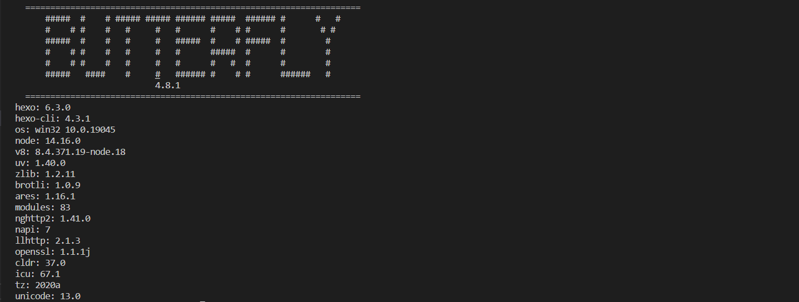


## 主题相关

主题的说明文档：

[快速上手]: https://butterfly.js.org/posts/21cfbf15/	"快速上手"

选用该主题的理由：

基于Hexo，操作方便；主题功能完善，配置清晰，侧边栏、阅读模式等功能接口完善且可以轻松的修改各个展示页面的数据；动效简洁明了，便于展示和测试；主题更新勤，目前最新的版本于23年发布，对新版本的插件和依赖适配完整；对移动端的适配度高，用手机浏览的动效依然完整；主题整体采用扁平化+部分拟物设计风格，挺好看且便于自定义编辑。

## 页面样式设计 & 功能实现（PC浏览器查看）

采用了butterfly主题提供的接口，设计了博客主页、文章index页、文章tag页、文章详情页等。

### 进入博客时的下滑页

在进入博客后不直接显示主页，下滑后展示（设计这个页面的初衷是优化移动设备的使用体验）。

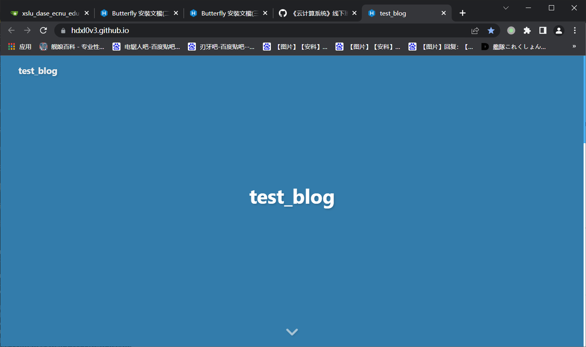

### 主页

下滑后进入首页，本博客中所有页面都分为**主干**和**侧边栏**。

#### 主干

中间主干部分按发布时间顺序展示博客文章，每个文章的发布日期右侧有一个**类型**用于区分该文章的种类。

在主页接着下滑（为了方便展示缩放了页面），主干下方为当前文章所在的页数，默认一页五个文章（点击页码可以跳转切换）。

主页最下方为Copyrights声明。

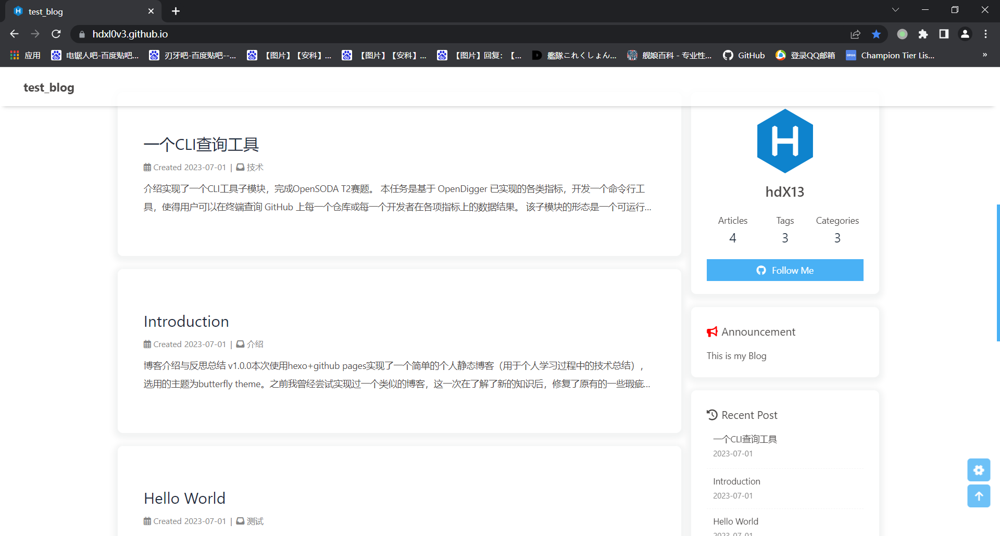

#### 侧边栏

右上角为博客整体情况和我的github信息链接，点击follow me按钮可以跳转到我的github主页。

follow me按钮上方有三个描述博客整体状态的信息，分别是文章数目articles、标签数目tags、文章种类数目categories。使用该栏目展示的目的是为了方便查看博客的整体信息，以及快速跳转到需要的类别，点击这三个栏目可以跳转到对应的分类页面，详见下文。

右侧Recent Post中展示了最近发布的几个博客，点击对应的博客可以直接跳转；

Categories栏下方是目前博客中已有的文章分类，点击任意一类可以直接跳转到对应类的categories页；

Tags栏下方是目前博客中已有的tag分类，点击任意一个tag可以直接跳转到对应的tags页；

Archive栏为按日期对博客中文章的归档，点击任意一个月份可以跳转到对应的Archive页；

Info栏显示该博客最近的使用状态，给出了UV、PV等指标；

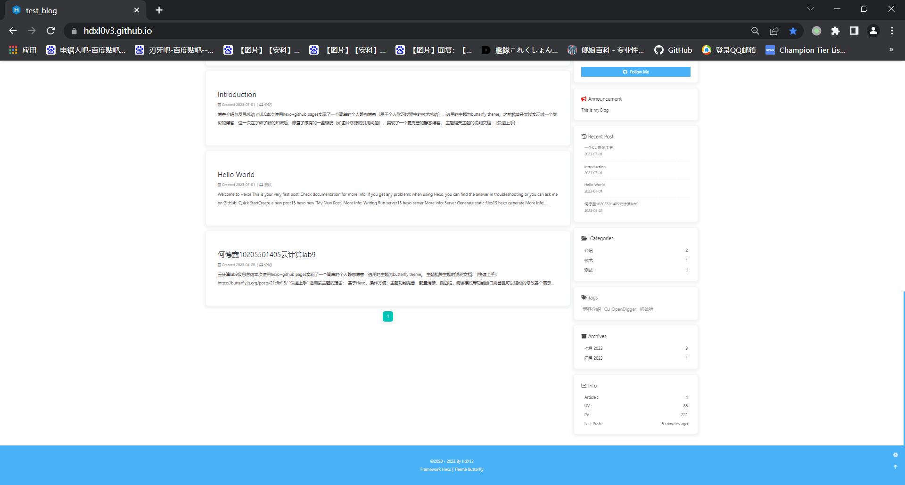

#### 页面个性化设置

主页右下方的齿轮按钮点击后可以设置页面的明暗、翻译、关闭侧边栏等功能；上箭头按钮点击后相当于按一次home键（回到下滑页）。

黑暗模式&繁简切换（点击右下角齿轮后，再点击展开的按钮）：

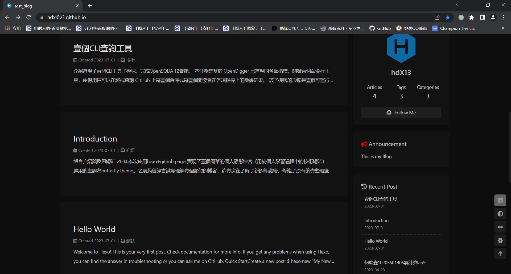

关闭侧边栏（点击右下角设置展开后的”左右箭头“按钮）：

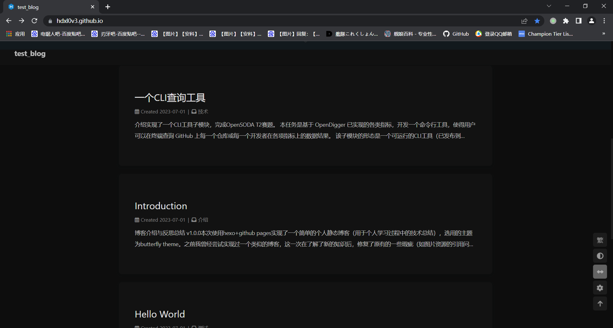

### Articles页

**前文提到的可跳转到的页面**，点击前文提到的**articles相关按钮**即可跳转。

在主干部分显示时间线上的文章发布，点击可跳转到**对应的文章**；

侧边栏的内容和前文提到的相同（每个页面都可以选择关闭侧边栏，操作方法同前文提到的）；

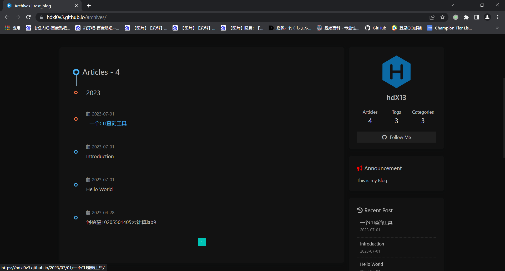

### Tags页

**前文提到的可跳转到的页面**，点击前文提到的**tags相关按钮**即可跳转。

在主干部分显示已有的所有tags，点击可跳转到**对应的文章列表**；

侧边栏的内容和前文提到的相同（每个页面都可以选择关闭侧边栏，操作方法同前文提到的）；

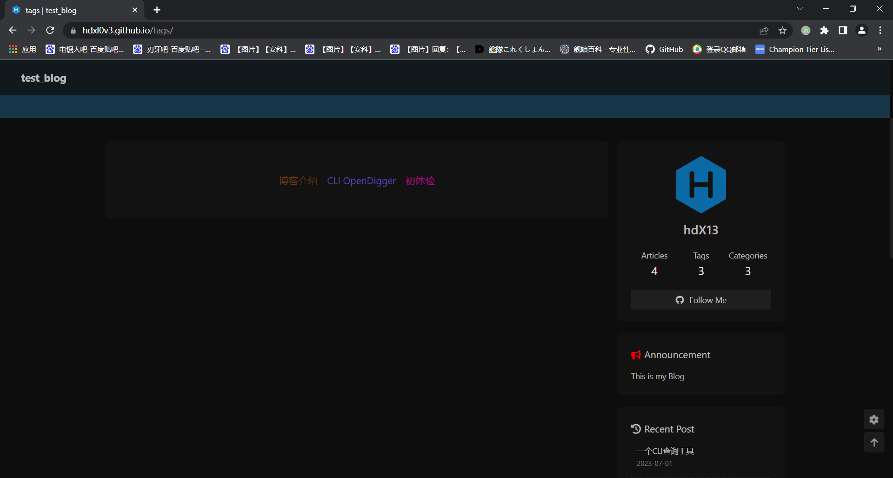

点击后跳转，显示该tag下**所有文章**；

点击对应的文章可以继续跳转到**对应的文章**；

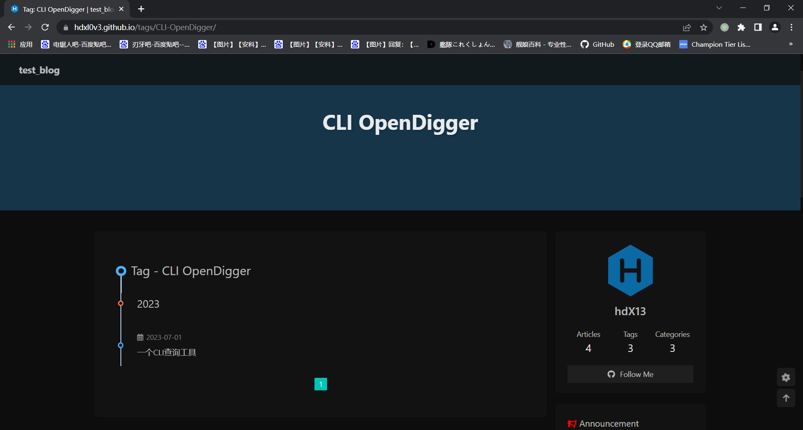

### Categories页

**前文提到的可跳转到的页面**，点击前文提到的**categories相关按钮**即可跳转。

在主干部分显示已有的所有文章类型，点击可跳转到**对应的文章列表**；

侧边栏的内容和前文提到的相同（每个页面都可以选择关闭侧边栏，操作方法同前文提到的）；

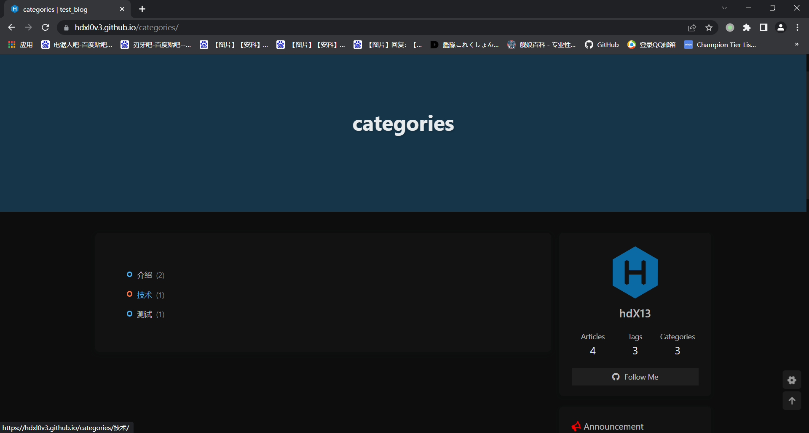

如上，点击”技术“一类后跳转到一个文章列表，显示**所有已有的该类型的文章**；

点击对应的文章可以跳转到文章内容页。

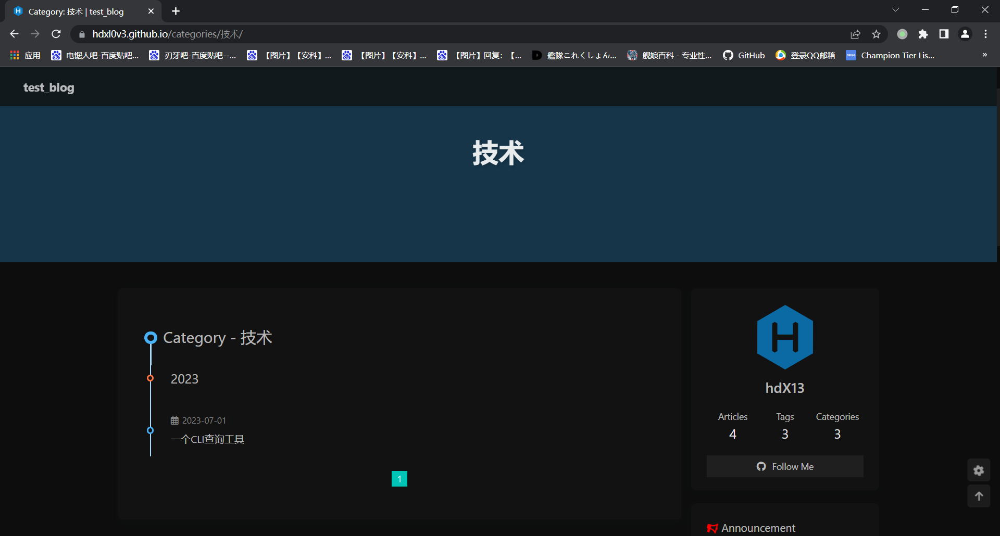

### 文章内容页

**点击前文提到的跳转按钮**，可以打开对应的一篇文章，其页面内容结构如下：

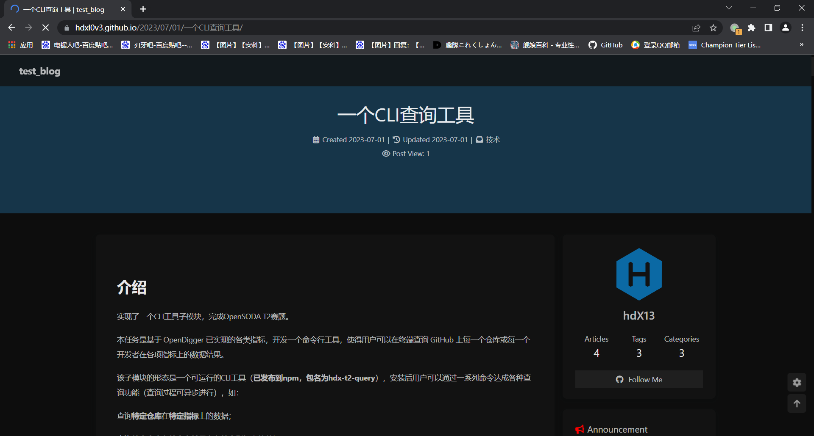

首部为文章的基本信息（发布时间、类型category、查看量等）；

主干部分为文章内容，右侧仍是侧边栏（可按前文提到的方法关闭侧边栏），在这里的侧边栏提供了**一个Catalog栏，用于展示该文章md文件中的目录和页数，点击对应段落可跳转到页面对应位置**。如下（Catalog右侧的数字为文章当前位置的页数）：

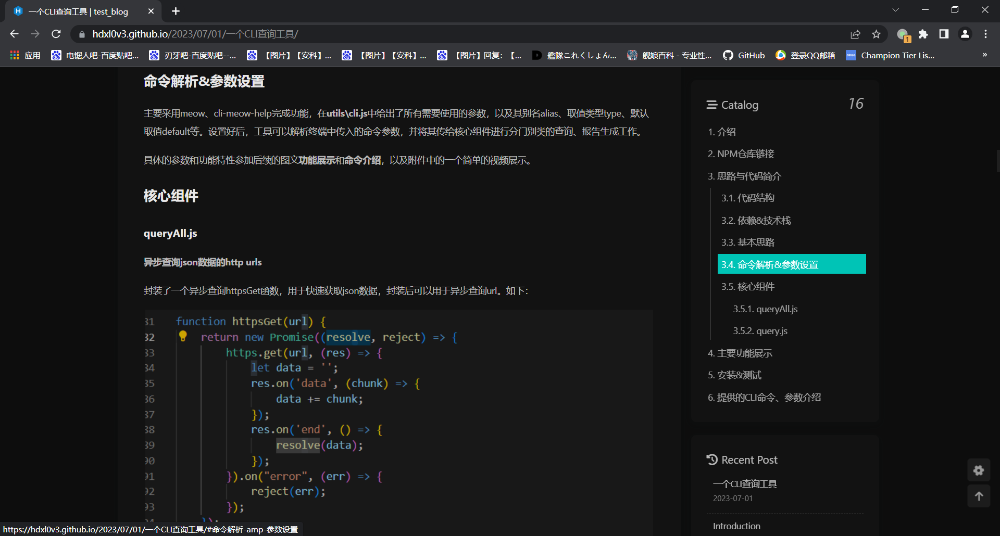

文章页末尾提供了该文章的**作者、链接等信息**。

下方的圆矩形为文章的tag，tag右侧的图标鼠标移上去可查看自动生成的分享链接/二维码，供移动设备查看。

最下方为按时间顺序可查看的下一篇、上一篇文章。

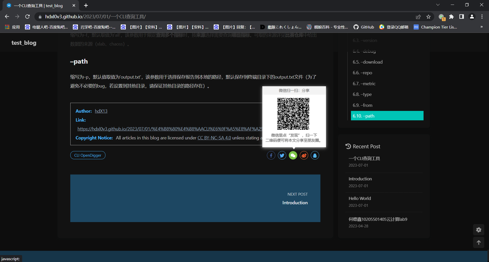

## 移动设备页面效果

前文展示了**在pc平台上博客网站的展示效果和功能设计**，此外本博客还兼容移动设备的浏览器，在移动设备上的显示效果和操作逻辑和pc端基本相同。故下面仅简单展示一下**主页和文章页**的效果。其他页面的具体情况可以扫描前文中提到的文章二维码后，再点击相应按钮跳转到对应页面进行查看。

### 主页效果

这里用MIUI的截长屏截取了完整主页（截屏过程中自动下滑并合并截图），如下：

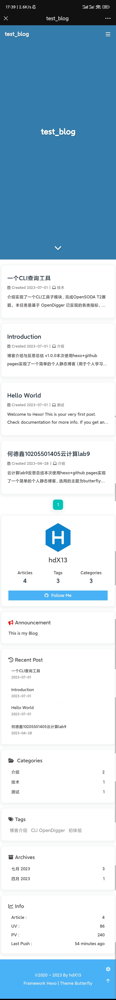

### 文章页效果

如下，通过微信扫码扫取前文提到的**文章二维码**后即可打开该博客文章，点击上部的”test_blog“可以跳转到移动端的播客主页：

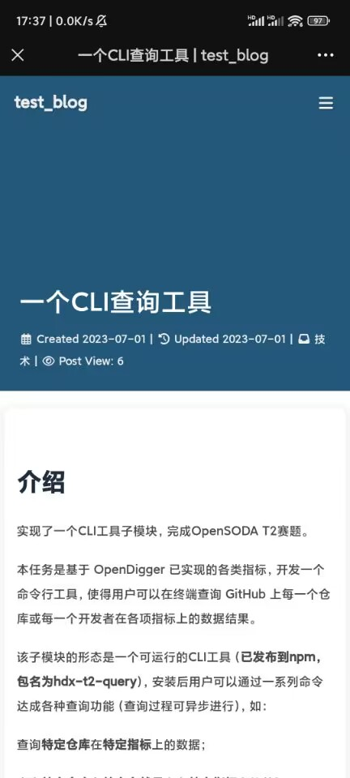

点击右下角齿轮展开后，可查看侧边栏中的文章目录：

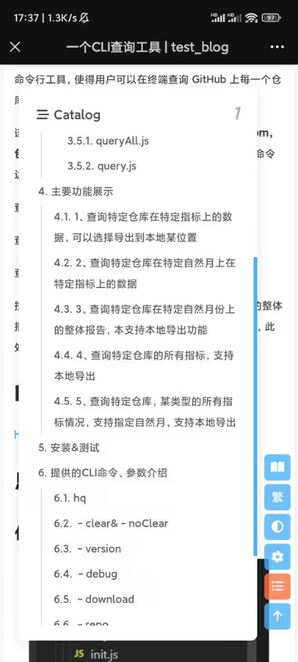

## 技术选择 & 遇到的问题

本次使用了hexo+github pages来实现静态博客网站，其中大量使用了butterfly theme中封装的接口进行页面排布和功能实现。

实现过程中先使用hexo本地部署项目，再在themes目录下克隆本次使用的butterfly主题（详细操作可见前文粘贴的butterfly theme的官方文档，这里节省篇幅不再详细解释）。在克隆主题后根据我自己的需要，在_config.yml中参照主题官方文档中的注释，录入我的博客信息并配置调用接口实现前文的博客功能。

### 项目结构

仓库中有两个分支，其中main为编译后部署的hexo静态页面，source_code分支为源代码。

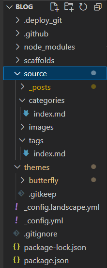

如上，使用hexo框架并导入了butterfly主题，在_config.yml中完成相应配置即可，故这里主要介绍一下source目录（页面结构）。

source/_posts：目录下为博客中展示的所有文章，其中每篇文章有一个同名的文件夹用于分类存放所需的图片。使用这个本地图片策略的目的是方便管理，且足以满足个人博客需要。

而在编写单个文章时，在文章首部需要按照butterfly主题的接口要求编写相关信息，如下（这里根据博客需要实现的功能来写入相关信息即可，不用所有文章都完整填写）：

```
---
title:
date:
updated:
tags:
categories:
keywords:
description:
top_img:
comments:
cover:
toc:
toc_number:
toc_style_simple:
copyright:
copyright_author:
copyright_author_href:
copyright_url:
copyright_info:
mathjax:
katex:
aplayer:
highlight_shrink:
aside:
abcjs:
---
```

source/categories：实现前文提到的Categories页，需要在首部的type标签中表明类型。

source/tags：实现前文提到的Tags页，需要在首部的type标签中表明类型。

source/images：最开始测试部署时使用的统一的本地图片目录，后续文章不使用该目录（按文章分类存放本地图片）。

### 使用Github Actions自动部署

由于hexo自带的部署命令需要先配置好hexo环境和相关插件，不便于我在多个设备上进行博客维护，故借助Github Actions实现了一个自动部署功能，把更新push到仓库即可自动完成博客部署的更新。

使用仓库Action完成自动部署，在仓库目录下新建了一个source_code分支：

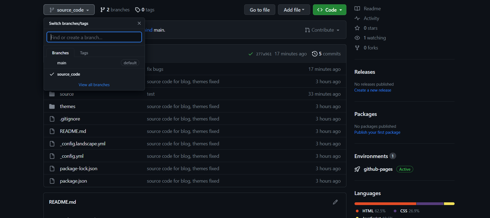

在.github/workflows/deploy.yml中编写部署actions，代码详见仓库，注意这里要先在仓库的secrets中添加正确的Personal access tokens：

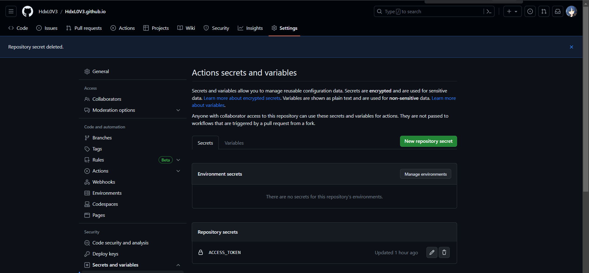

完成以上设置后即可在任意环境完成博客的更新和自动部署，示例如下：

```
// 在新机器克隆仓库（机器有git密钥）
git clone https://github.com/HdxL0V3/HdxL0V3.github.io.git
// 切换到源代码分支
git checkout source_code
// 修改博客文章或博客代码
...
// 将修改push到仓库
git add .
git commit -m 'description'
git push
```

接着查看仓库中的actions进行情况和网站情况即可：

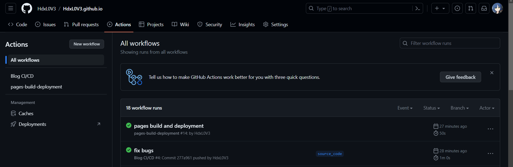

顺利完成。


### 主要遇到的问题

#### **文章的图片资源加载问题**

在我之前的博客实现经验中，在hexos中使用本地图片是一件麻烦的事情——在markdown中图片地址和最后生成的网页中文章中的图片地址不一致。解决这个问题需要打上一些相关的插件或者是使用图床，但无论哪种方法我都认为不够直观、便捷（不能使用markdown原生的书写语法，而且还有广告和付费的问题）。

在最初的实验中我尝试了asset-image插件和直接把图片放在根目录source/images文件夹的方式，虽然可以在网页端上正确显示，但是在本地编辑文章的过程中不能直观的显示图片（插件的语法和md原本的语法不一致），而且不方便分类管理各个文章需要的图片。

在查询资料后我发现新版的hexos核心中整合了一个新的图片插件，既可以保持markdown原有语法，又可以在网页上正确展示本地图片。在config中修改设置如下：

```
// 在_config.yml中修改
post_asset_folder: true
marked:
  prependRoot: true
  postAsset: true
```

启用后，资源图片将会被自动解析为其对应文章的路径，现在即可顺利地在文章md文件中调用本地目录下的图片，并在部署后顺利展示了。

（如下，可以在_posts目录下为每个文章md提供一个同名目录，用于存放其所需的图片）

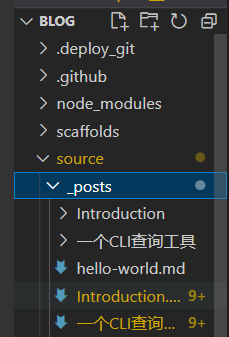

#### 自动部署Action执行失败

如下，执行时报错：

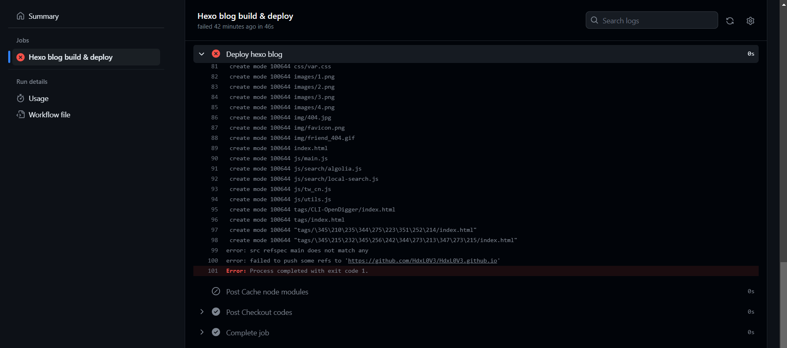

根据报错信息，查看代码发现是仓库分支名错误，本地git init后生成的分支为master，原先以为是main故导致命令错误，修改deploy.yml中对应命令后即可修复，如下：

```
      # 将编译后的博客文件推送到指定仓库
      run: |
        cd ./public && git init && git add .
        git config user.name "HdxL0V3"
        git config user.email "1191845623@qq.com"
        git add .
        git commit -m "GitHub Actions Auto Builder at $(date +'%Y-%m-%d %H:%M:%S')"
        git push --force --quiet "https://${{ secrets.ACCESS_TOKEN }}@$GITHUB_REPO" master:main
```


## 总结

本次用Hexo+github pages搭建了一个简易个人博客，进一步熟悉了相关操作，为今后的技术文章存放、个人简历制作方面等需求积累了经验。
