# 介绍

实现了一个CLI工具子模块，完成OpenSODA T2赛题。

本任务是基于 OpenDigger 已实现的各类指标，开发一个命令行工具，使得用户可以在终端查询 GitHub 上每一个仓库或每一个开发者在各项指标上的数据结果。

该子模块的形态是一个可运行的CLI工具（**已发布到npm，包名为hdx-t2-query**），安装后用户可以通过一系列命令达成各种查询功能（查询过程可异步进行），如：

查询**特定仓库**在**特定指标**上的数据；

查询**特定仓库**在**特定自然月**上在**特定指标**上的数据；

查询**特定仓库**在**特定自然月份**上的**整体报告**；

按类型、来源等**分类**查询**特定仓库**在**特定自然月份**上的整体报告（**其余具体功能**见后续的功能展示和CLI命令介绍，此处不一一列出）。


# NPM仓库链接

https://www.npmjs.com/package/hdx-t2-query


# 思路与代码简介

## 代码结构

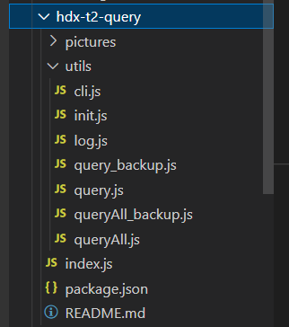

README.md即该文档，package.json为包信息设置，index.js为框架入口。

utils目录下为工具的各个模块（其中query_backup.js和queryAll_backup.js为开发过程中的测试代码，在成品版本中作为留档，无功能作用）。

pictures目录下为README.md中需要加载的图片，若在npm网页端仓库图床加载失败，可支持下载源码并查看图片完整的README.md文档。

## 依赖&技术栈

详细依赖，可见npm仓库。技术栈为nodejs与npm，版本如下：

node.js：14.16.0

npm：6.14.18

## 基本思路

本次查询任务总的来说有两种：查询**单个特定指标**和查询**多个符合条件的指标**。故在实现组件的过程中将两类查询分别在query.js和queryAll.js中用两个异步函数进行实现。

在index.js入口中，根据给定的参数来决定时查询单个指标还是多个指标，并选择启动query还是queryAll，同时传入相应的参数（flags）。如下：

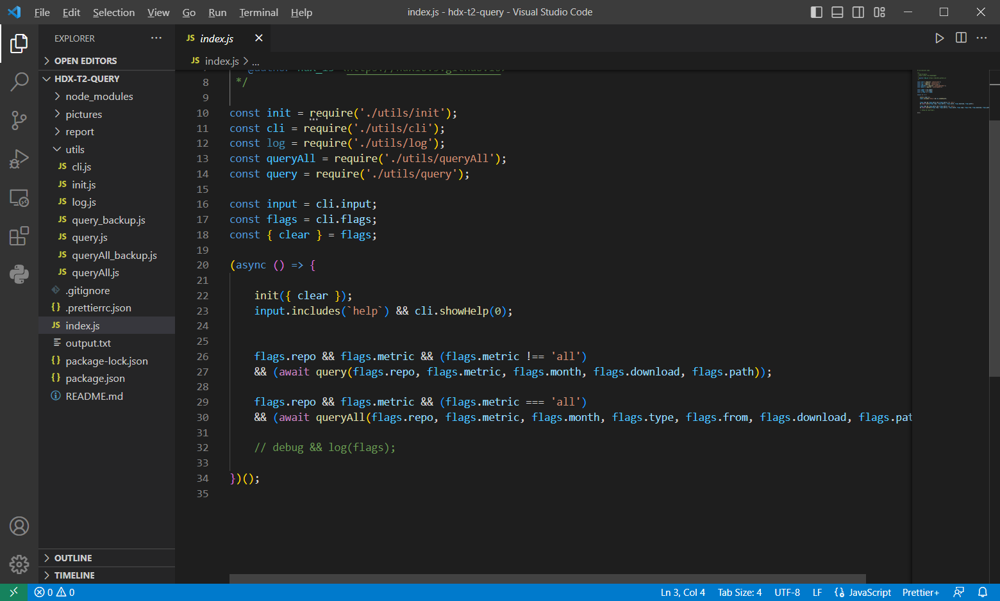

## 命令解析&参数设置

主要采用meow、cli-meow-help完成功能，在**utils\cli.js**中给出了所有需要使用的参数，以及其别名alias、取值类型type、默认取值default等。设置好后，工具可以解析终端中传入的命令参数，并将其传给核心组件进行分门别类的查询、报告生成工作。

具体的参数和功能特性参加后续的图文**功能展示**和**命令介绍**，以及附件中的一个简单的视频展示。

## 核心组件

### queryAll.js

**异步查询json数据的http urls**

封装了一个异步查询httpsGet函数，用于快速获取json数据，封装后可以用于异步查询url。如下：

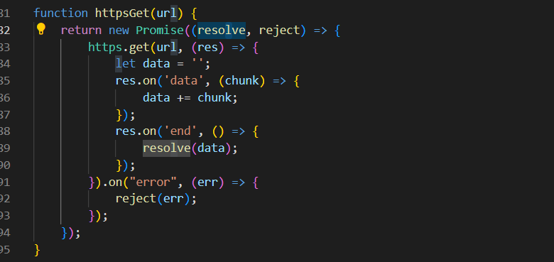

**类型、来源筛选的实现**

在内部维护了两个js对象typeList和fromList，用字典的形式保存各个指标对应的指标类型和来源，根据命令给出的参数来筛选出需要查询的指标（代码实现中为两步筛选后取并集，可以单独查询满足某个类型指定，或者满足多个类型指定的**所有指标**），默认情况下为查询所有指标生成报告。如下：

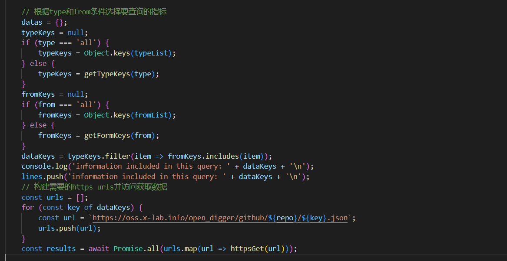

**构建url格式**

按照给定仓库中json数据的url格式进行构建即可，在上述代码中可以简单查看（详见源代码即可）。注意这里构建了所有需要查询的数据对应的url。

**输出和保存格式化**

在输出指标和保存报告的过程中，为了方便查看，需要将repo、type、from等信息规范化输出保存，在代码中对console.log输出的字符串进行相应的格式化（先解析函数收到的参数内容，再将得到的信息用于格式化输出）。期间维护了一个数组用于记录每条输出，最后用该数组进行本地文件的导出（download）。如下：

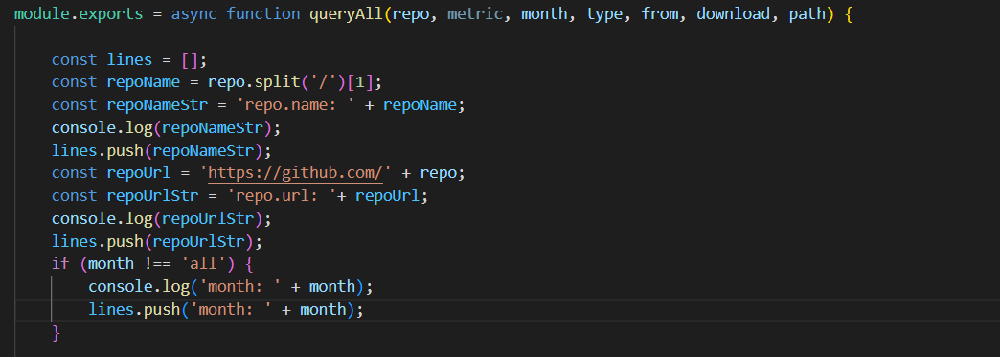

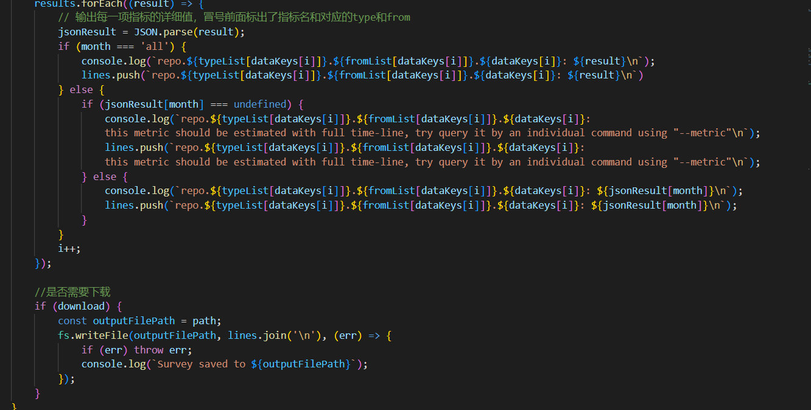


### query.js

query实际上是queryAll的一个特例（或**简化版**），故这里从主要异同点进行简单介绍。

同样使用了上述包装后的httpGet函数、相同的输出格式化。区别主要在于构建url时**根据筛选条件只会构建一条需要的url**用于查询；以及并没有始终维护一个记录输出的数组用于保存文件，而是在最后选择是否保存文件时再查询一次并构建输出，这样是因为查询特定指标时报告的输出会比较短，没必要始终维护一个数组进行记录，且查询的开销较低。如下：

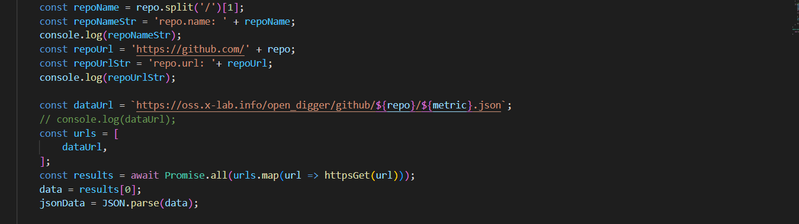

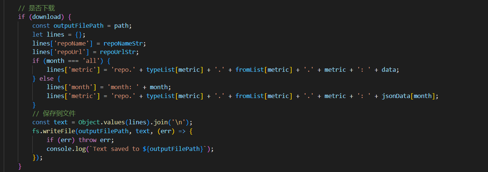


# 主要功能展示

**（npm网页若不显示图片，系图床加载超时，此时请下载源代码查看README.md文档）**

## 1、查询特定仓库在特定指标上的数据，可以选择导出到本地某位置

**查询，不导出报告**

```
hq --repo X-lab2017/open-digger --metric openrank
```

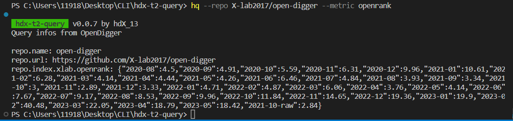

**查询，导出报告（默认路径为：当前目录下/output.txt，可通过--path参数自行设定，此处先新建一个report文件夹，在设置参数保存报告到此文件夹中）**

```
mkdir report
hq --repo X-lab2017/open-digger --metric openrank --download --path report/output.txt
```

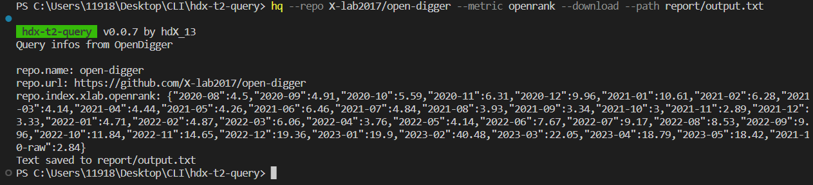

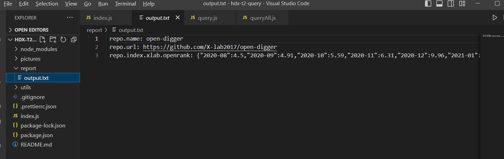

## 2、查询**特定仓库**在**特定自然月**上在**特定指标**上的数据

**前者不保存报告文件，后者保存（此处不设置路径，默认输出到终端目录下output.txt）**

```
hq --repo X-lab2017/open-digger --metric openrank --month 2023-01
hq --repo X-lab2017/open-digger --metric openrank --month 2023-01 --download
```

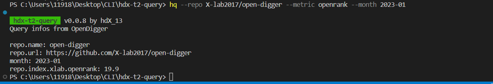

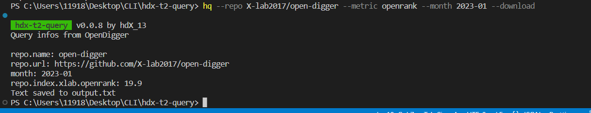

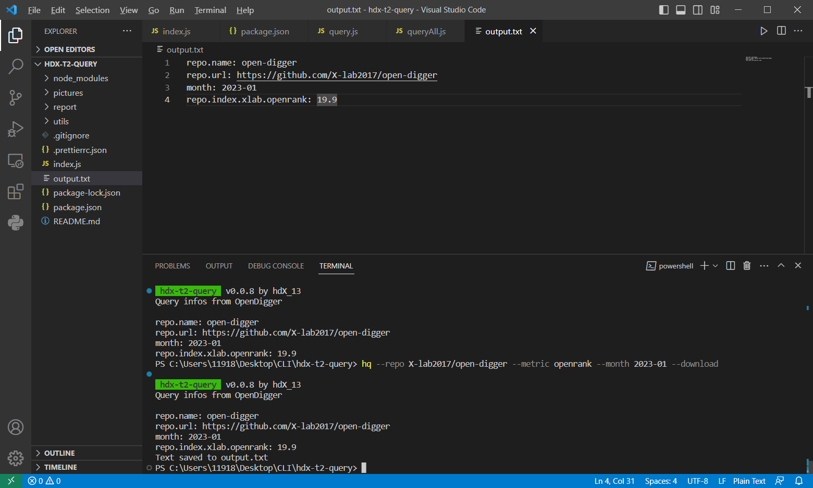

## 3、查询**特定仓库**在**特定自然月份**上的**整体报告**，本支持本地导出功能

**前者不保存报告文件，后者保存（此处不设置路径，默认输出到终端目录下output.txt）**

```
hq --repo X-lab2017/open-digger --month 2023-01
hq --repo X-lab2017/open-digger --month 2023-01 --download
```

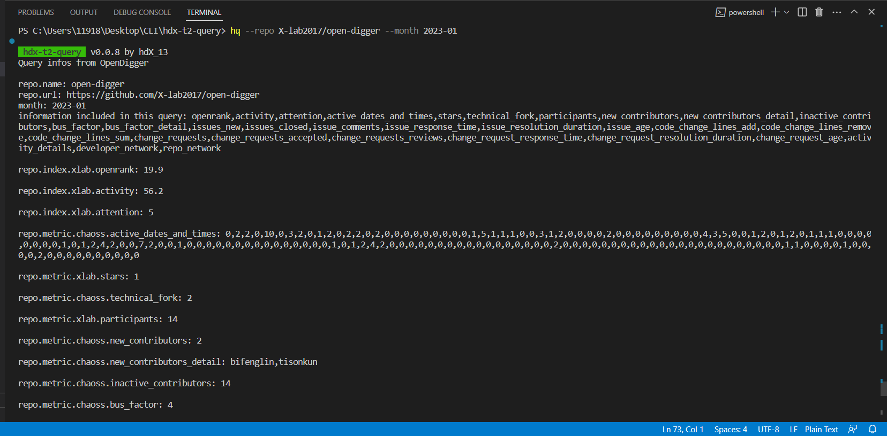

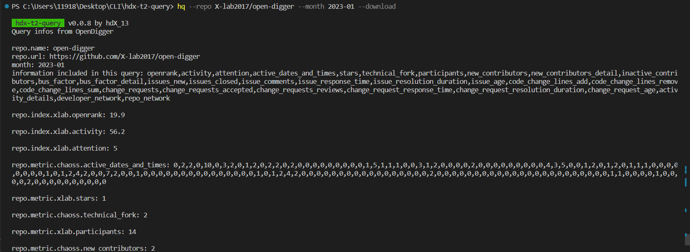

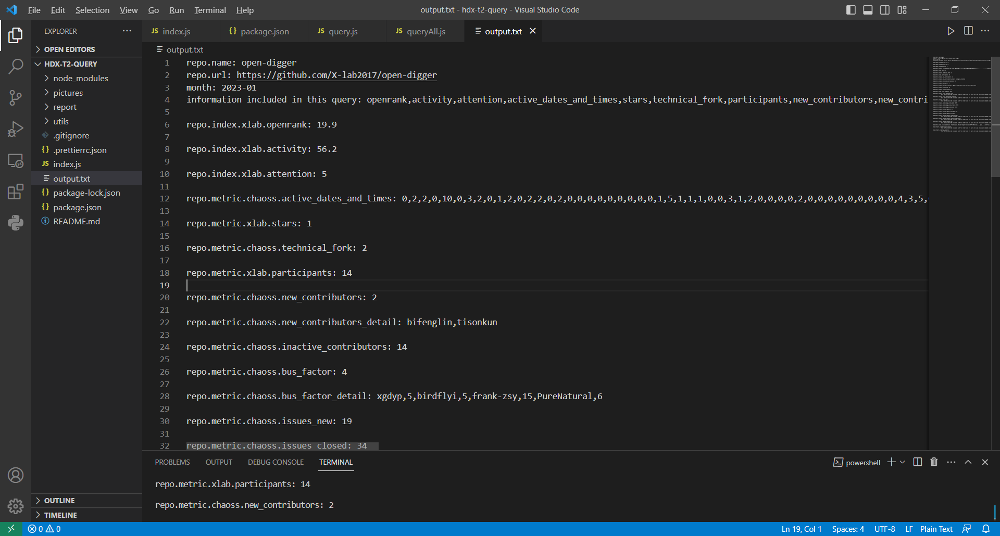

## 4、查询特定仓库的所有指标，支持本地导出

```
hq --repo X-lab2017/open-digger
hq --repo X-lab2017/open-digger --download
```

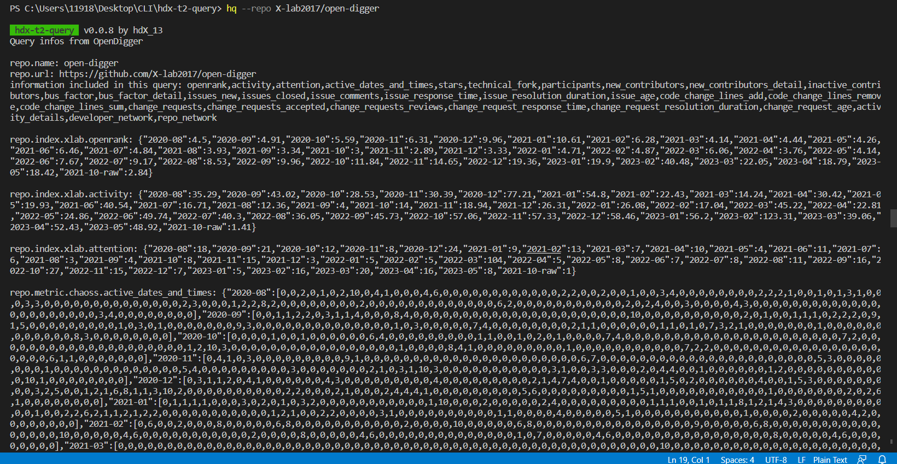

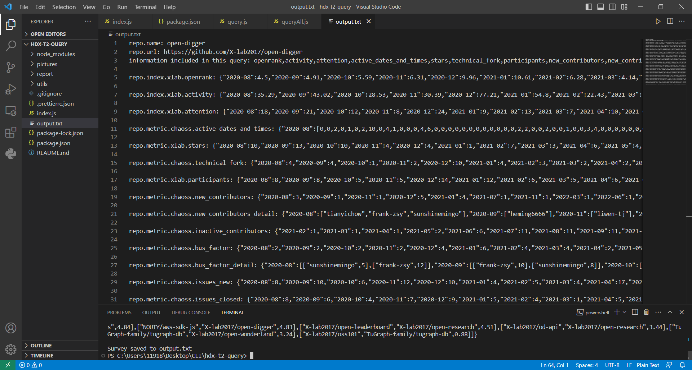

## 5、查询特定仓库，某类型的所有指标情况，支持指定自然月，支持本地导出

**查询类型Type为index的所有指标，后者设置了--download可保存报告到本地**

```
hq --repo X-lab2017/open-digger --type index
hq --repo X-lab2017/open-digger --type index --download
```

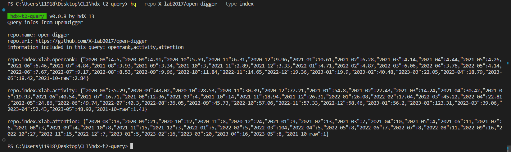

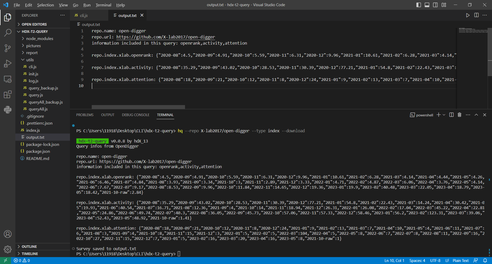

**查询来源from为chaoss的所有指标，后者指定了某个月份**

```
hq --repo X-lab2017/open-digger --from chaoss
hq --repo X-lab2017/open-digger --from chaoss --month 2023-01
```

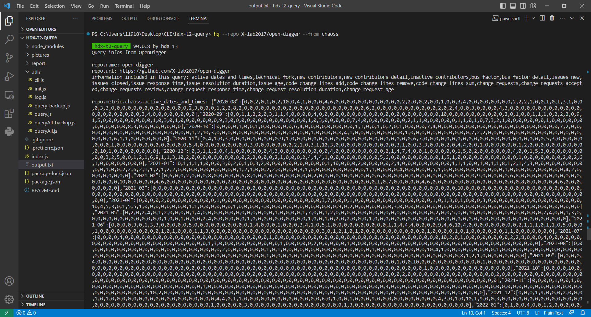

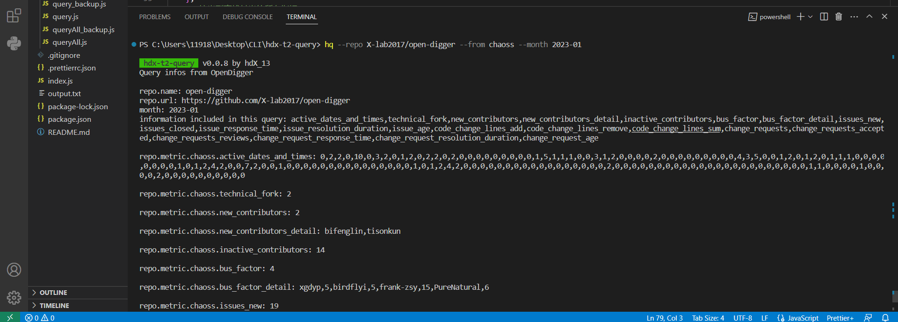

**查询同时满足指定类型和指定来源的指标，支持指定自然月**

```
hq --repo X-lab2017/open-digger --type metric --from chaoss --month 2023-01
```

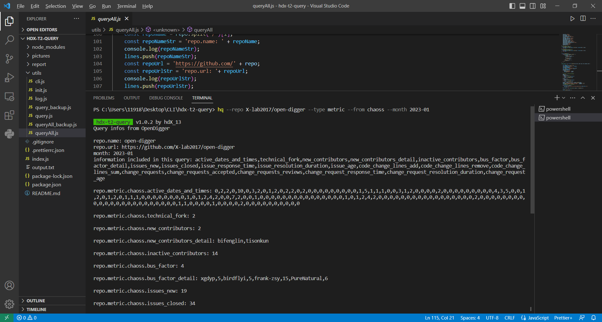


# 安装&测试

全局安装

```
// 安装
npm install -g hdx-t2-query
// 测试运行&修改代码功能
hq -v
...
// 卸载
npm uninstall -g hdx-t2-query
```

开发者测试

```
// 先下载源代码，再进入源代码目录执行命令，进行link
npm link
// 测试运行&修改代码功能
hq -v
...
// 取消link
npm unlink
```


# 提供的CLI命令、参数介绍

## hq

为hdx-t2-query缩写，此处用作启动工具。

## --clear&--noClear

设置在每次查询前后是否对终端清屏，主要在开发测试中使用，最终版本中我已经把该功能关闭。

## --version

缩写为--v，查看工具版本。

## --debug

用于debug的选项，最终版本中我已把该功能关闭，若需要请手动修改打开。

## --download

缩写为--d，默认取值为false，用于设置是否将报告保存到本地。

## --repo

缩写为--r，默认取值为'X-lab2017/open-digger'，即指向本次查询仓库（本工具按要求使用了给定仓库的数据，故该值**无特殊情况不用更改，请使用默认值**。若要查询其他仓库，需要对源代码做微调，因为其他仓库的数据指标路径不一定和比赛仓库的数据指标路径格式相同）。

## --metric

缩写为--me，默认取值为'all'，当取all时将查询符合要求的**所有**指标；当取特定指标名字时将**只**查询该特定指标的情况。

## --type

缩写为--ty，默认取值为'all'，该参数用于限定**查询多个指标**时，按**类型**选择需要查询**哪些指标**。可取的类型详见**比赛仓库**中给出数据的类型（index、metric等）。

## --from

缩写为--f，默认取值为'all'，该参数用于限定**查询多个指标**时，按**来源**选择需要查询**哪些指标**。可取的来源详见**比赛仓库**中给出数据的来源（xlab、chaoss）。

## --path

缩写为--p，默认值取值为'output.txt'，该参数用于选择保存报告到本地的路径，默认保存到终端目录下的output.txt文件（为了避免不必要的bug，若设置到其他目录，请保证其他目录的路径存在）。
