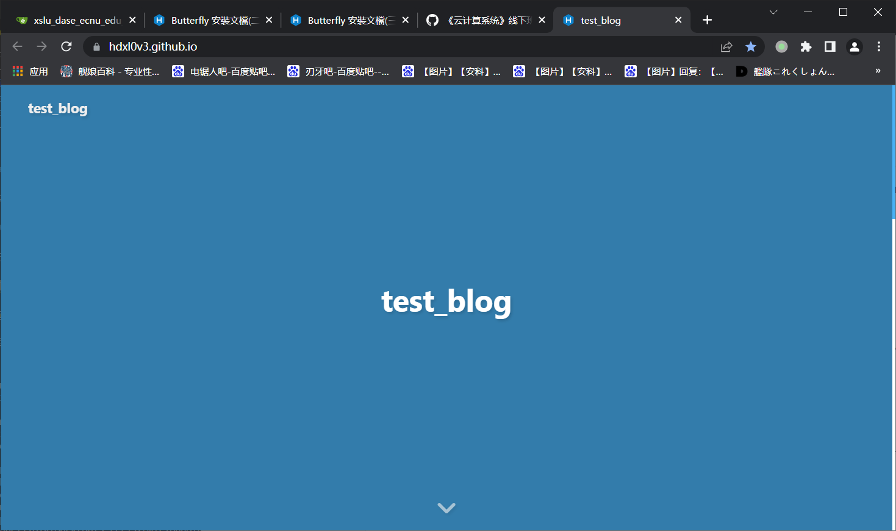

## 云计算lab9反思总结

本次使用hexo+github pages实现了一个简单的个人静态博客，选用的主题为butterfly theme。

### 主题相关

主题的说明文档：

[快速上手]: https://butterfly.js.org/posts/21cfbf15/	"快速上手"

选用该主题的理由：

基于Hexo，操作方便；主题功能完善，配置清晰，侧边栏、阅读模式等功能接口完善且可以轻松的修改各个展示页面的数据；动效简洁明了，便于展示和测试；主题更新勤，目前最新的版本于23年发布，对新版本的插件和依赖适配完整；对移动端的适配度高，用手机浏览的动效依然完整；主题整体采用扁平化+部分拟物设计风格，挺好看且便于自定义编辑。

### 页面设计

主要采用butterfly的默认框架，修改博客名、作者信息、关注链接等信息为自己的即可，如下：

进入后的下滑页

下滑后进入主页，可以看到侧边栏和博客信息完善，右下角提供了阅读模式、黑暗界面、简繁体等UI设置按钮：

### Hexo本地目录编辑&部署到github

在hexo目录下修改_config.yml中的基础信息（主要是github的deploy地址和用户名以及页面link），再在themes中克隆下来的butterfly主题中修改config文件，微调页面的展示效果即可（大多数只需要修改true/false即可，基础的功能都已经写好）。博客和图片目录均在source目录下：

本地hexo server测试完毕后部署到个人仓库即可（用.io域名，干净又卫生），这里我账号有现成的ssh key，略过相关配置说明：

### 流程中的小问题

部署过程中images图片目录原先放置在_posts目录下跟随对应的博客md，但网页端无法正确显示引用情况，排查问题是没有安装相应的路径插件，可以安装插件解决。但插件不是很方便，所以我最后选择直接放在source源目录下一个集中的images目录中，后续如果需要写更多博客再选用更方便的插件。

### 总结

本次用Hexo搭建了一个小小个人静态博客，熟悉了相关操作，或许之后可能会派上用场。